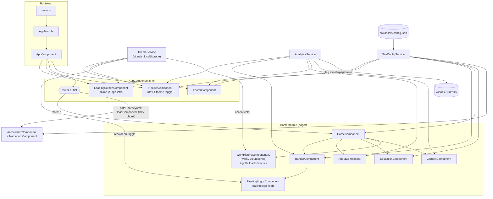
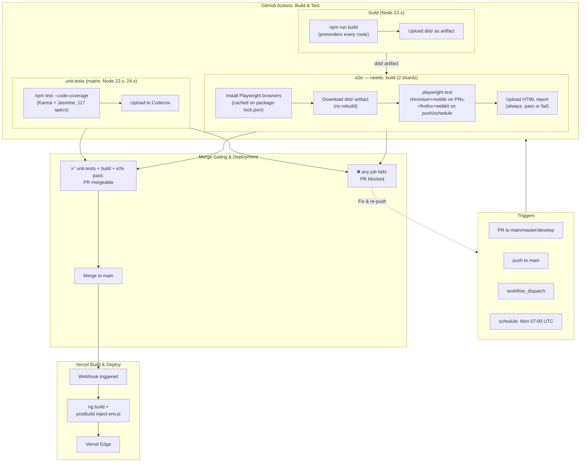
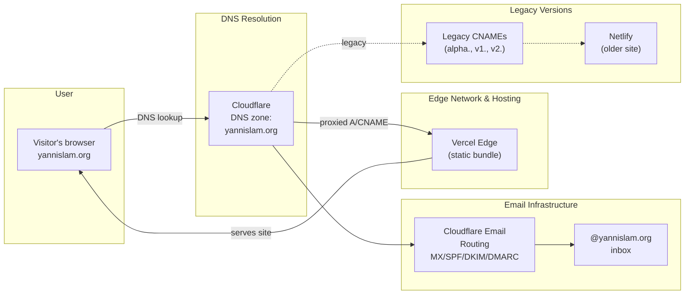

# Yannis Lam Portfolio Website v.3

[](https://angular.dev)
[](https://www.typescriptlang.org/)
[](https://github.com/AardeYamz/v3.yannislam.org/actions/workflows/build-test.yml)
[](https://github.com/AardeYamz/v3.yannislam.org/actions/workflows/security.yml)
[](https://getbootstrap.com/)
[](https://vercel.com)
[](https://www.cloudflare.com/)
[](https://analytics.google.com/)
[](LICENSE)

This project was generated with [Angular CLI](https://github.com/angular/angular-cli) version 19, and later updated to version 22.
- Forked from [Lê Thanh Tuấn's Portfolio](https://github.com/lethanhtuan939/Portfolio)
- Which was based on [José Hernández's Portfolio](https://github.com/andresjosehr/andresjosehr-portfolio)
- And adapted from [Brittany Chiang's Portfolio](https://github.com/bchiang7/v4)

## Getting Started

### Prerequisites
You need to have npm and Angular CLI installed in your pc. Npm is available with NodeJS in [here](https://nodejs.org/). After you install npm, install Angular CLI with the following command in your terminal

``` bash
npm install -g @angular/cli
```

### Installing

Just clone  the repo and excecute the following command inside the folder project

``` bash
npm install
```

### All done!

Now just run
```
npm start
```
or
```
ng serve
```

Wait to compile and go to [http://localhost:4200](http://localhost:4200) after compile finish

### Development server

The application will automatically reload if you change any of the source files.

## Stack

**Framework & language**
- [Angular](https://angular.dev) 22 (`@angular/cli`, `@angular/core`, `@angular/router`, `@angular/animations`, `@angular/forms`) — `NgModule`-based app shell, with a few standalone components (`AardeYamzComponent`, `NamecardComponent`) lazy-loaded off the router
- TypeScript 6, strict mode + `strictTemplates`

**UI & content**
- [@ng-bootstrap/ng-bootstrap](https://ng-bootstrap.github.io/) 21 + [Bootstrap](https://getbootstrap.com/) 5 — layout, nav (`ngbNav`), dropdowns
- [@fortawesome/fontawesome-free](https://fontawesome.com/) 7 — iconography
- [ngx-typed-js](https://www.npmjs.com/package/ngx-typed-js) — the banner's typewriter effect
- [ngx-owl-carousel-o](https://www.npmjs.com/package/ngx-owl-carousel-o) — work history carousel
- [animejs](https://animejs.com) 4 — the boot-time loading screen's logo assembly animation (see `docs/changes/20260728-132036-animejs-loading-screen.md`)
- AOS-style scroll reveal via a custom `AosDirective` (`src/app/directives/aos/`)
- A hand-rolled `requestAnimationFrame` loop powers `FloatingLogosComponent`, a field of falling logo marks behind the banner greeting (see `docs/changes/20260729-090717-floating-logos-banner.md`)
- `LogoFallbackDirective` (`src/app/directives/logo-fallback/`) generates a data-URI SVG placeholder — the organization's name as themed accent-colored text — for work/education entries with no logo image
- All page copy (nav, banner, about, education, work history, contact, footer socials) is data-driven from `src/assets/config.json`, read through a single `SiteConfigService` (see `docs/changes/20260728-160203-config-dedup-refactor.md`)

**Analytics**
- Google Analytics 4 via the global `gtag.js` site tag, loaded inline in `src/index.html`; `AnalyticsService` calls the global `gtag()` directly — no analytics npm package is used (an earlier `ngx-google-analytics` integration was removed since it was never wired up) — see `docs/changes/20260727-205542-google-analytics-1.md`

**Infrastructure & deployment**
- **Hosting/build**: [Vercel](https://vercel.com) builds and serves the production app (`vercel.json`); a `postbuild` step (`scripts/inject-env.js`) substitutes `%GOOGLE_ANALYTICS_ID%` in `index.html` from Vercel's environment at build time so the ID isn't hardcoded in source
- **DNS, CDN proxy & email**: [Cloudflare](https://www.cloudflare.com/) manages the `yannislam.org` zone — proxied `A`/`CNAME` records in front of Vercel, plus Cloudflare Email Routing (MX/SPF/DKIM/DMARC) for `@yannislam.org` mail
- Legacy/preview subdomains (`alpha.`, `v1.`, `v2.`) still resolve to Netlify via Cloudflare CNAMEs from earlier iterations of this site

## Architecture



### Deployment & DNS

#### GitHub Actions CI/CD Pipeline



A push that supersedes an in-flight run (e.g. two commits pushed to the same
PR seconds apart) cancels the older run via `concurrency: cancel-in-progress`
— `e2e` is the most expensive job here, so stacked runs on a rapid push
sequence would otherwise waste CI minutes.

#### DNS & Content Delivery



#### GitHub Actions Workflow: `build-test.yml`

Triggers: pull requests into `main`/`master`/`develop`, pushes to `main`,
manual `workflow_dispatch`, and a Monday 07:00 UTC schedule. The workflow is
three jobs, `build` and `e2e` chained so the app is only compiled once:

**1. `unit-tests`** (matrix: Node 22.x, 24.x — both must pass)
- `npm ci`, then `npm test -- --watch=false --browsers=ChromeHeadless --code-coverage`
  (Karma + Jasmine, 117 specs against `TestBed` fixtures)
- Uploads `coverage/v3.yannislam.org/lcov.info` to [Codecov](https://codecov.io)

**2. `build`** (Node 22.x)
- `npm run build` — Angular AOT build, prerendering every known route
  (`/`, `/projects`, `/projects/highschool`, `/aardeyamz`, `**`) to static
  HTML (see `docs/changes/20260811-013939-ssr-prerendering.md`)
- Verifies `dist/` exists, then uploads it as a build artifact
  (`retention-days: 1`) for the `e2e` job to reuse

**3. `e2e`** (`needs: build`, sharded 2-way, `fail-fast: false`)
- Installs Playwright's browsers (cached on `package-lock.json`) and
  downloads the `build` job's `dist/` artifact — no second build
- Runs `playwright test` against that artifact via a static server
  (Chromium + mobile on PRs; adds Firefox + WebKit on push-to-`main` and the
  nightly schedule — see [E2E Testing](#e2e-testing-playwright) below)
- Always uploads the HTML report/traces/videos, pass or fail, per shard —
  that's the whole debugging story for a flaky E2E failure

**Merge Gating**
- All three jobs (both `unit-tests` matrix legs, `build`, both `e2e` shards)
  must pass for the PR to become mergeable
- Any failure blocks the merge; fix the issue and push to re-run the workflow
- Passing PR can be merged to the base branch, triggering Vercel's production build and deployment

**After Merge: Production Deployment**
- Merge to base branch → Vercel webhook triggers → Vercel builds production bundle
- `scripts/inject-env.js` substitutes Google Analytics ID from Vercel environment
- Cloudflare DNS routes `yannislam.org` to Vercel's edge network
- Cloudflare also handles email routing (MX/SPF/DKIM/DMARC) for `@yannislam.org`
- Legacy subdomains (`alpha.`, `v1.`, `v2.`) still resolve to Netlify via Cloudflare CNAMEs from earlier site iterations

## Code Structure

```
.github/
├── workflows/
│   └── build-test.yml        # CI/CD: unit-tests -> build -> e2e, see "GitHub Actions Workflow" above
e2e/                          # Playwright E2E specs — see "E2E Testing" below
├── fixtures.ts               # gotoAndSettle() boot-wait helper, analytics blocking, SW isolation
├── smoke.spec.ts
├── home-sections.spec.ts
├── navigation.spec.ts
└── theme.spec.ts
playwright.config.ts
src/
├── app/
│   ├── animations/           # Shared Angular animation triggers (e.g. fade-stagger)
│   ├── components/
│   │   ├── general/          # Chrome shared across every route
│   │   │   ├── header/       # Nav bar + theme toggle
│   │   │   ├── footer/       # Footer (repo link, built-with, design credits)
│   │   │   └── loading-screen/  # Boot-time anime.js logo intro
│   │   ├── home/             # Sections that make up the "/" route (HomeModule, eager)
│   │   │   ├── banner/       # Hero banner + typewriter effect
│   │   │   ├── floating-logos/  # Falling logo-mark field behind the banner greeting
│   │   │   ├── about/        # About + AardeYamz name-meaning cards
│   │   │   ├── education/    # Education list
│   │   │   ├── workhistory/  # Work/volunteering timeline (reused for both)
│   │   │   ├── contact/      # Contact section
│   │   │   ├── projects/     # College projects
│   │   │   └── projects-highschool/  # High school projects
│   │   └── other/
│   │       └── aardeyamz/    # Standalone "/aardeyamz" route, lazy-loaded (+ NamecardComponent)
│   ├── directives/
│   │   ├── aos/               # Custom scroll-reveal directive (AOS-style)
│   │   └── logo-fallback/     # Generates a themed placeholder logo SVG when no image is set
│   ├── pipes/linkify/        # Turns plain-text URLs into links
│   ├── services/
│   │   ├── site-config/      # SiteConfigService — the only reader of assets/config.json
│   │   ├── theme/            # ThemeService — light/dark theme, signals + localStorage
│   │   ├── analytics/        # AnalyticsService — calls the global gtag() directly
│   │   └── resume/           # Resume link/download handling, reads assets/resume-manifest.json
│   ├── app.module.ts         # Root NgModule (eager HomeModule, lazy AardeYamz route)
│   └── app-routing.module.ts # Top-level routes
├── assets/
│   ├── config.json           # All page copy/content — see "Updating the config file" below
│   ├── resume-manifest.json  # Generated at build/serve time — see note below (gitignored)
│   ├── fonts/                # Calibre, SF Mono
│   ├── images/                # Logos, profile photos, project screenshots
│   └── resume/                # Downloadable resume file(s)
└── enviroment/                # Angular environment files
```

`scripts/generate-resume-manifest.js` runs as a `pre*` hook before `start`,
`build`, `watch`, and `test` (see `package.json`). It scans
`src/assets/resume/` for files named `<anything> YYYYMMDD.pdf`, picks the
newest by date, and writes its filename to `src/assets/resume-manifest.json`,
which `ResumeService` imports as a TS module — so dropping in a new dated
resume PDF is all that's needed to update the site's download link, no code
change required.

Every component under `components/` follows the standard Angular trio
(`*.component.ts` / `.html` / `.scss`, plus a `.spec.ts` where present).
Components read content through `SiteConfigService` rather than importing
`config.json` directly — see `docs/changes/20260728-160203-config-dedup-refactor.md` for why.
Other write-ups worth skimming when touching a specific area live in
`docs/changes/` (loading screen animation, Google Analytics wiring, the
projects and volunteering sections, the falling-logos banner background,
SVG logo conversion + the 3-state light/dark theme system, the header's
scroll-translucency and left-to-right entrance animation, and Angular
version upgrade notes).

## Updating the Config File

Nearly all page content — nav labels, bio text, work/education/volunteering
history, project write-ups, footer links, and site metadata — is data-driven
from [`src/assets/config.json`](src/assets/config.json). To personalize this
site for your own use, you generally only need to edit that file; component
templates shouldn't need to change.

Key sections:

- **`siteMenu`** — top nav items. Each entry needs `navTitle`, `siteLocation`
  (route or `/#anchor`), and optionally `navNumber`/`navContent`/`scrollSection`
  for in-page sections.
- **`logos`** — a keyed map of `{ src, alt }` image references, reused by
  `logoKey` across `experiences.work.list`, `experiences.education`, and
  `experiences.volunteering.list` so a logo is only defined once. If an
  entry's `logoKey` is omitted or its `src` is empty, the `logoFallback`
  directive auto-generates a themed placeholder (the organization's name as
  wrapped, accent-colored text) instead — no image asset required.
- **`about`** — `first`/`last` name, `email`, the `contact` list (social
  links, each with an `icon` matching a Font Awesome class), and the
  `aardeyamz` array powering the name-meaning cards.
- **`about.experiences`** — `work` and `volunteering` each have a `list` of
  entries (`organization`, `title`, `timeframe`, `description[]`, `skills[]`,
  optional `logoKey`/`link`/`about`/`tab`), plus a top-level `education`
  array in the same shape. `skills` at the bottom of `experiences` is the
  flat skills summary shown separately from any one job.
- **`banner`** — hero `greeting`/`name`/`blurb` and the `typeSection` array
  cycled by the typewriter effect.
- **`footer`** — repo link, "built with" credit, and `designCredits`.
- **`projects.college` / `projects.highschool`** — each a `list` of
  `{ imgs[], title, timeframe, description[], link? }` project cards.
- **`siteTitle`, `heading`, `subHeading`, `manifest*`** — page `<title>` and
  PWA manifest fields (name, short name, start URL, theme/background colors,
  icon).

Image `src` values can be either a hosted URL or a path under `src/assets/`.
There's no JSON schema enforced at build time, so keep new entries consistent
with the shape of existing ones in the same array. After editing, `npm start`
/ `ng serve` picks up changes on save like any other source file.

## Testing

The project uses **Karma** and **Jasmine** for unit testing with a headless Chrome browser:

### Running Tests

```bash
# Run tests in headless mode (CI-friendly)
npm test -- --watch=false

# Run tests with auto-reload on file changes (development)
npm test

# Run tests with code coverage
npm test -- --watch=false --code-coverage
```

### Environment Setup

Tests require Chromium to be available. In this project:
- **Chromium Path**: `/opt/pw-browsers/chromium`
- **Karma Config**: `karma.conf.js`
- **Test Configuration**: `tsconfig.spec.json`

The `CHROME_BIN` environment variable is set automatically by the test runner when using the pre-installed Chromium binary:

```bash
CHROME_BIN=/opt/pw-browsers/chromium npm test -- --watch=false
```

### Test Coverage

Run tests with coverage reporting:

```bash
npm test -- --watch=false --code-coverage
```

## E2E Testing (Playwright)

Unit tests above run every spec against a `TestBed` fixture with children
stubbed — real page composition, boot-time animation, nav clicks, and theme
switching aren't exercised at all there. [Playwright](https://playwright.dev)
end-to-end tests in `e2e/` close that gap by driving a real browser against
the actual built app. See
`docs/changes/20260811-030901-playwright-e2e-testing.md` for the full
write-up (what's covered, why, and non-obvious fixture decisions);
`docs/todo/playwright-e2e-testing-plan.md` for the original plan this implements
(P0 coverage so far — P1/P2 phases like `projects`/`resume`/`accessibility`
specs and visual regression are still just that document, not yet built).

### Running Tests

```bash
# Headless — against the production build in CI (CI=1), against `ng serve` locally
npm run test:e2e

# Playwright's interactive UI mode (recommended for writing/debugging specs)
npm run test:e2e:ui

# Open the last run's HTML report (traces, screenshots, videos on failure)
npm run test:e2e:report
```

Locally, `npm run test:e2e` starts its own `ng serve` dev server via
Playwright's `webServer` config (`reuseExistingServer` if one's already
running) — no separate build step needed. In CI, it instead serves the
`build` job's `dist/v3.yannislam.org/browser` output through a static
server with SPA-fallback routing, matching what Vercel actually deploys.

### Browser Setup

```bash
npx playwright install --with-deps chromium firefox webkit
```

Only needed once per machine — CI installs fresh on every run, cached on
`package-lock.json` so a cache hit is a fast no-op verification rather than
a full re-download.

### What's covered

- **`smoke.spec.ts`** — the boot sequence (loading overlay → header mounts →
  `document.body` scroll restored), the page `<title>`, and zero console
  errors / failed same-origin requests on every route
- **`home-sections.spec.ts`** — every home-page section (banner, about,
  education, work, volunteering) renders real content sourced from
  `config.json`, not hardcoded copy
- **`navigation.spec.ts`** — desktop nav scroll-to-section and route clicks,
  hard navigation to every lazy-loaded route, the wildcard-to-`/` redirect,
  and browser back/forward
- **`theme.spec.ts`** — the `default → light → dark → default` cycle
  actually recolors the live DOM (not just the service's internal signal),
  persists across reload via `localStorage`, and resolves correctly from the
  OS `prefers-color-scheme` when nothing's stored

Determinism controls worth knowing about if you're adding a spec: never
`waitForTimeout()` past the loading screen — use `gotoAndSettle()` from
`e2e/fixtures.ts`, which waits for the header nav to actually be visible.
Third-party analytics requests (`gtag.js`, Vercel Analytics/Speed Insights)
are blocked automatically for every test via the same fixture.

Coverage reports are uploaded to [Codecov](https://codecov.io) automatically by the GitHub Actions CI/CD pipeline on every PR. View coverage metrics and trends at the project's [Codecov dashboard](https://codecov.io).

## Dependency Security

Two tools split the job, because neither does the whole of it well:

- **[Dependabot](https://docs.github.com/en/code-security/dependabot)** opens
  the bump PRs. `.github/dependabot.yml` configures the weekly *version*
  updates (Monday 06:00 UTC) for both `npm` and `github-actions`; the
  alerts-driven *security* updates come from the repository's security
  settings and are batched into a single PR by the `security-updates` group.
- **[Aikido](https://www.aikido.dev)** triages. Dependabot will happily open a
  PR for a critical advisory in a transitive dev dependency that no shipped
  code path can reach; Aikido scans the repo and tells you whether the
  finding is actually reachable, so the PR queue stays signal.

Bumps are grouped rather than one-per-package: `angular` (the `@angular/*`
packages plus the libraries pinned to an Angular major, which have to move in
lockstep or the workspace won't build), `testing`, and a `minor-and-patch`
catch-all. Majors are deliberately left ungrouped so each arrives alone and
can be reverted alone — and Angular majors are ignored outright, since they're
upgraded by hand through `ng update` and its migration schematics (see
`docs/changes/20260727-205542-UPGRADE-NOTES.md`).

The Aikido scan (`.github/workflows/security.yml`) runs on PRs, on pushes to
`main`, and weekly at 06:30 UTC — half an hour behind Dependabot, so it sees
whatever was just opened. It **skips itself, green, until it's activated**:
install the [Aikido GitHub App](https://github.com/marketplace/aikido-security),
then add the CI secret key as `AIKIDO_SECRET_KEY` under both
*Settings → Secrets and variables → Actions* **and** *→ Dependabot*. That
second copy is not optional — Dependabot PRs read from a separate secret
store, so without it the scan skips on exactly the PRs it was added for.

See `docs/changes/20260811-124323-dependabot-aikido-integration.md` for the
full write-up, including the failure modes this configuration is shaped
around.
