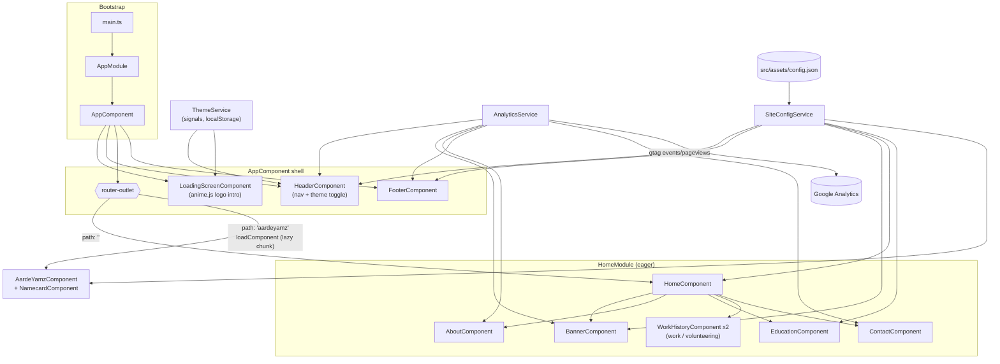
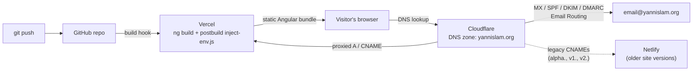

# Yannis Lam Portfolio Website v.3

[](https://angular.dev)
[](https://www.typescriptlang.org/)
[](https://getbootstrap.com/)
[](https://vercel.com)
[](https://www.cloudflare.com/)
[](https://analytics.google.com/)
[](LICENSE)

This project was generated with [Angular CLI](https://github.com/angular/angular-cli) version 19, and later updated to version 22.
- Forked from [Lê Thanh Tuấn's Portfolio](https://github.com/lethanhtuan939/Portfolio)
- Which was based on [José Hernández's Portfolio](https://github.com/andresjosehr/andresjosehr-portfolio)
- And adapted from [Brittany Chiang's Portfolio](https://github.com/bchiang7/v4)

## Getting Started

### Prerequisites
You need to have npm and Angular CLI installed in your pc. Npm is available with NodeJS in [here](https://nodejs.org/). After you install npm, install Angular CLI with the following command in your terminal

``` bash
npm install -g @angular/cli
```

### Installing

Just clone  the repo and excecute the following command inside the folder project

``` bash
npm install
```

### All done!

Now just run
```
npm start
```
or
```
ng serve
```

Wait to compile and go to [http://localhost:4200](http://localhost:4200) after compile finish

### Development server

The application will automatically reload if you change any of the source files.

## Stack

**Framework & language**
- [Angular](https://angular.dev) 22 (`@angular/cli`, `@angular/core`, `@angular/router`, `@angular/animations`, `@angular/forms`) — `NgModule`-based app shell, with a few standalone components (`AardeYamzComponent`, `NamecardComponent`) lazy-loaded off the router
- TypeScript 6, strict mode + `strictTemplates`

**UI & content**
- [@ng-bootstrap/ng-bootstrap](https://ng-bootstrap.github.io/) 21 + [Bootstrap](https://getbootstrap.com/) 5 — layout, nav (`ngbNav`), dropdowns
- [@fortawesome/fontawesome-free](https://fontawesome.com/) 7 — iconography
- [ngx-typed-js](https://www.npmjs.com/package/ngx-typed-js) — the banner's typewriter effect
- [ngx-owl-carousel-o](https://www.npmjs.com/package/ngx-owl-carousel-o) — work history carousel
- [animejs](https://animejs.com) 4 — the boot-time loading screen's logo assembly animation (see `documentation/animejs-loading-screen.md`)
- AOS-style scroll reveal via a custom `AosDirective` (`src/app/directives/aos/`)
- All page copy (nav, banner, about, education, work history, contact, footer socials) is data-driven from `src/assets/config.json`, read through a single `SiteConfigService` (see `documentation/config-dedup-refactor.md`)

**Analytics**
- [ngx-google-analytics](https://www.npmjs.com/package/ngx-google-analytics) wrapping Google Analytics (gtag.js), routed through an `AnalyticsService` — see `documentation/google-analytics.md`

**Infrastructure & deployment**
- **Hosting/build**: [Vercel](https://vercel.com) builds and serves the production app (`vercel.json`); a `postbuild` step (`scripts/inject-env.js`) substitutes `%GOOGLE_ANALYTICS_ID%` in `index.html` from Vercel's environment at build time so the ID isn't hardcoded in source
- **DNS, CDN proxy & email**: [Cloudflare](https://www.cloudflare.com/) manages the `yannislam.org` zone — proxied `A`/`CNAME` records in front of Vercel, plus Cloudflare Email Routing (MX/SPF/DKIM/DMARC) for `@yannislam.org` mail
- Legacy/preview subdomains (`alpha.`, `v1.`, `v2.`) still resolve to Netlify via Cloudflare CNAMEs from earlier iterations of this site

## Architecture



### Deployment & DNS



## Code Structure

```
src/
├── app/
│   ├── animations/           # Shared Angular animation triggers (e.g. fade-stagger)
│   ├── components/
│   │   ├── general/          # Chrome shared across every route
│   │   │   ├── header/       # Nav bar + theme toggle
│   │   │   ├── footer/       # Footer (repo link, built-with, design credits)
│   │   │   └── loading-screen/  # Boot-time anime.js logo intro
│   │   ├── home/             # Sections that make up the "/" route (HomeModule, eager)
│   │   │   ├── banner/       # Hero banner + typewriter effect
│   │   │   ├── about/        # About + AardeYamz name-meaning cards
│   │   │   ├── education/    # Education list
│   │   │   ├── workhistory/  # Work/volunteering timeline (reused for both)
│   │   │   ├── contact/      # Contact section
│   │   │   ├── projects/     # College projects
│   │   │   └── projects-highschool/  # High school projects
│   │   └── other/
│   │       └── aardeyamz/    # Standalone "/aardeyamz" route, lazy-loaded (+ NamecardComponent)
│   ├── directives/aos/       # Custom scroll-reveal directive (AOS-style)
│   ├── pipes/linkify/        # Turns plain-text URLs into links
│   ├── services/
│   │   ├── site-config/      # SiteConfigService — the only reader of assets/config.json
│   │   ├── theme/            # ThemeService — light/dark theme, signals + localStorage
│   │   ├── analytics/        # AnalyticsService — wraps ngx-google-analytics/gtag
│   │   └── resume/           # Resume link/download handling
│   ├── app.module.ts         # Root NgModule (eager HomeModule, lazy AardeYamz route)
│   └── app-routing.module.ts # Top-level routes
├── assets/
│   ├── config.json           # All page copy/content — see "Updating the config file" below
│   ├── fonts/                # Calibre, SF Mono
│   ├── images/                # Logos, profile photos, project screenshots
│   └── resume/                # Downloadable resume file(s)
└── enviroment/                # Angular environment files
```

Every component under `components/` follows the standard Angular trio
(`*.component.ts` / `.html` / `.scss`, plus a `.spec.ts` where present).
Components read content through `SiteConfigService` rather than importing
`config.json` directly — see `documentation/config-dedup-refactor.md` for why.
Other write-ups worth skimming when touching a specific area live in
`documentation/` (loading screen animation, Google Analytics wiring, the
projects and volunteering sections, dark-mode logo handling, and Angular
version upgrade notes).

## Updating the Config File

Nearly all page content — nav labels, bio text, work/education/volunteering
history, project write-ups, footer links, and site metadata — is data-driven
from [`src/assets/config.json`](src/assets/config.json). To personalize this
site for your own use, you generally only need to edit that file; component
templates shouldn't need to change.

Key sections:

- **`siteMenu`** — top nav items. Each entry needs `navTitle`, `siteLocation`
  (route or `/#anchor`), and optionally `navNumber`/`navContent`/`scrollSection`
  for in-page sections.
- **`logos`** — a keyed map of `{ src, alt }` image references, reused by
  `logoKey` across `experiences.work.list`, `experiences.education`, and
  `experiences.volunteering.list` so a logo is only defined once.
- **`about`** — `first`/`last` name, `email`, the `contact` list (social
  links, each with an `icon` matching a Font Awesome class), and the
  `aardeyamz` array powering the name-meaning cards.
- **`about.experiences`** — `work` and `volunteering` each have a `list` of
  entries (`organization`, `title`, `timeframe`, `description[]`, `skills[]`,
  optional `logoKey`/`link`/`about`/`tab`), plus a top-level `education`
  array in the same shape. `skills` at the bottom of `experiences` is the
  flat skills summary shown separately from any one job.
- **`banner`** — hero `greeting`/`name`/`blurb` and the `typeSection` array
  cycled by the typewriter effect.
- **`footer`** — repo link, "built with" credit, and `designCredits`.
- **`projects.college` / `projects.highschool`** — each a `list` of
  `{ imgs[], title, timeframe, description[], link? }` project cards.
- **`siteTitle`, `heading`, `subHeading`, `manifest*`** — page `<title>` and
  PWA manifest fields (name, short name, start URL, theme/background colors,
  icon).

Image `src` values can be either a hosted URL or a path under `src/assets/`.
There's no JSON schema enforced at build time, so keep new entries consistent
with the shape of existing ones in the same array. After editing, `npm start`
/ `ng serve` picks up changes on save like any other source file.
